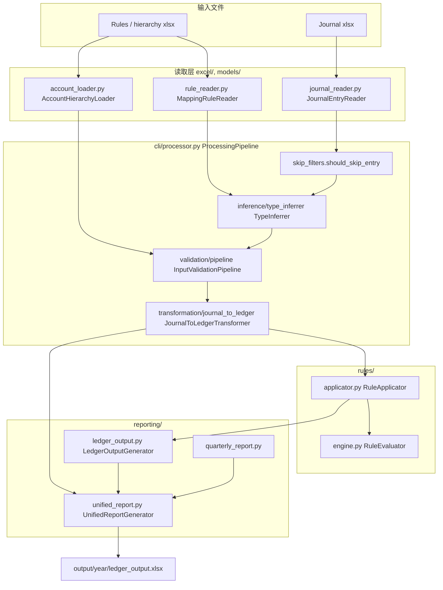

# LedgerFlow / veritas-accounting — 模块与数据流

本文档用图表说明 Python 包内主要模块如何协作完成「日记账 Excel → 规则引擎 → 统一报表 Excel」。

## 统一流水线（主路径）

## 关键点简述

| 步骤 | 模块 | 作用 |
|------|------|------|
| 读表 | `JournalEntryReader` | 解析列为 `JournalEntry` |
| 读规则 | `MappingRuleReader` | 解析列为 `MappingRule`，编译规则表达式 |
| 跳过不入账行 | `skip_filters` | 金额为 0；描述含「余利宝-基金赎回」「余利宝自动转入」 |
| 缺失类型推断 | `TypeInferrer` | 从规则条件里的 `"关键词" in description` 推断 `old_type` |
| 校验 | `InputValidationPipeline` | 校验分录与规则 |
| 转换 | `JournalToLedgerTransformer` + `RuleApplicator` | 每条日记账生成借贷分类账分录 |
| 报表 | `UnifiedReportGenerator` | 写入单个工作簿：Journal Entry Categorization、Account Summary (by Year)、Quarterly Report、Audit & Review |

## 其它入口

- **`scripts/process_multi_sheet.py`**：按年份 sheet 循环调用 `ProcessingPipeline`
- **`veritas-accounting process`**：`cli/commands.py` 同上

如需单独的 Flagged Entries Excel（复核预览样式），可使用 `reporting/review_preview.py` 中的 `ReviewPreviewGenerator`（并非默认 unified 工作簿的一部分）。
